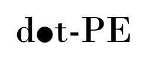

## Purpose

DOT-PE is a Python package for parameter estimation and evidence integration using data from the gravitational wave interferometer observatories LIGO, Virgo, and KAGRA. Unlike traditional approaches that rely on stochastic samplers, DOT-PE performs parameter estimation and evidence integration using matrix multiplications for fast likelihood evaluation. All interfacing with gravitational wave data, waveform generation, and sampling tools is handled through the [`cogwheel`](https://github.com/jroulet/cogwheel) package.

## Installation

### Basic Installation

Clone the repository:
```bash
git clone https://github.com/jonatahm/dot-PE.git
cd dot-pe
```

Create and activate the conda environment:
```bash
conda env create -f environment.yml
conda activate dot-pe
```

## Usage

See the notebooks in the `notebooks/` directory for examples.

## License

This project is licensed under the GNU General Public License v3.0 – see the [LICENSE](LICENSE) file for details. 
